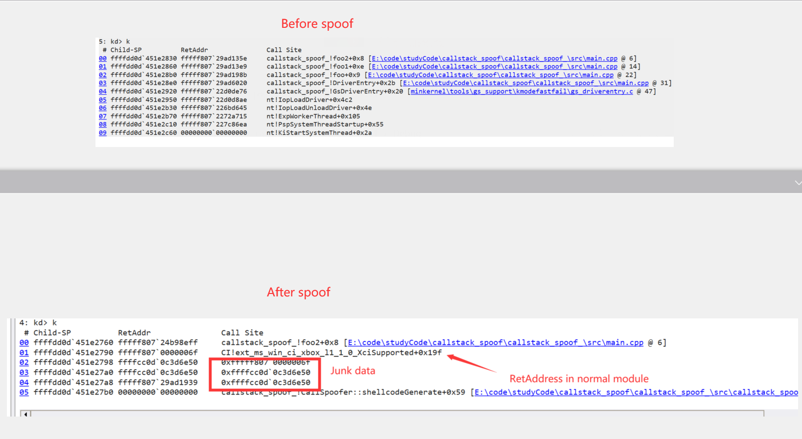

# introduce

- **callstack spoof是一个混淆堆栈的工具,主要可以在你调用函数的时候混淆返回地址,并且这个返回地址位于正常模块内**

- callstack spoof" is a tool for obfuscating the call stack. It primarily obfuscates the return address when you call a function, and this return address is located within a normal module

# usage

- **这个POC支持R3 R0,使用起来简单**

- This POC supports kernel mode and user mode, and it's easy to use

```C++
int foo2(int a) {
	__debugbreak();
	DbgPrintEx(77,0,"%d\r\n", a);
	return a;  
}

void foo1() {

	foo2(111);
	auto ret=SPOOF_CALL(int, foo2)(111);
	DbgPrintEx(77, 0, "func ret->%d\r\n", ret);
	
}
```


# POC



# thanks

https://github.com/Barracudach/CallStack-Spoofer

**I must thank @Barracudach. My project is based on what he wrote. The only flaw in his project is that when spoofing the call stack, the return address is in an illegal module (or not in a module at all). I have improved upon this shortcoming**

